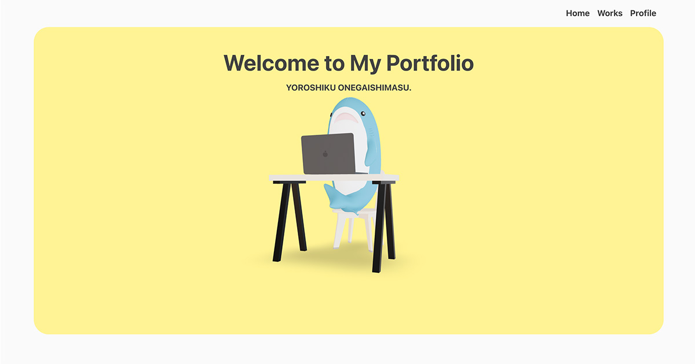

# Portfolo

Next.js を使用して作成したポートフォリオサイトです。


## 🚀 デモ

- [https://portfolio-hina-ohsawas-projects.vercel.app](https://portfolio-hina-ohsawas-projects.vercel.app)

## 仕様

メインビジュアルに React Three Fiber を使用して 3D モデルを表示しています。
Canvas 上でドラッグやスクロールすると視点を動かすことができます。

## Run Command

First, run the development server:

```bash
npm run dev
# or
yarn dev
# or
pnpm dev
# or
bun dev
```

Open [http://localhost:3000](http://localhost:3000) with your browser to see the result.

## Build Command

```bash
npm run build
```

## Start Command

```bash
npm run start
```
